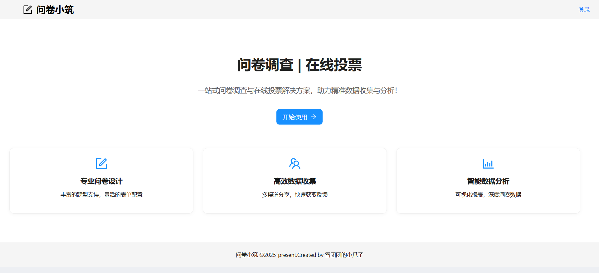
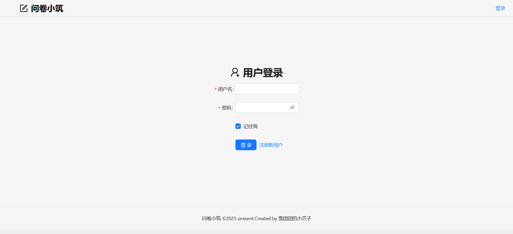
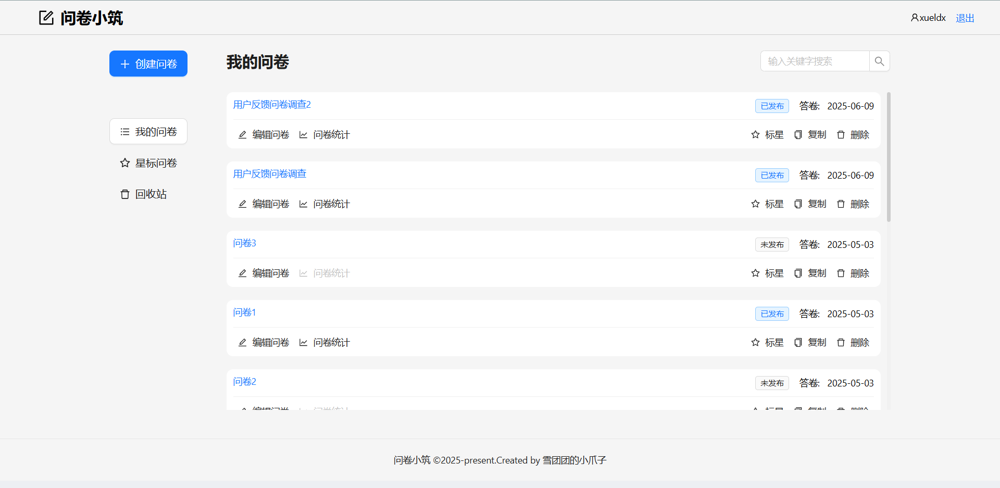
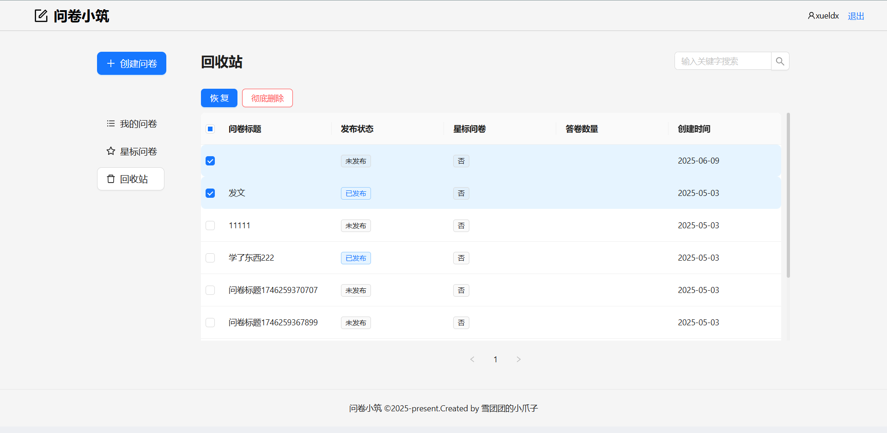
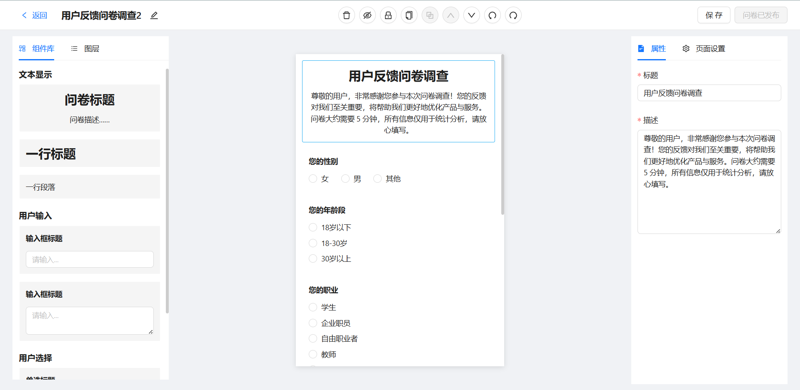
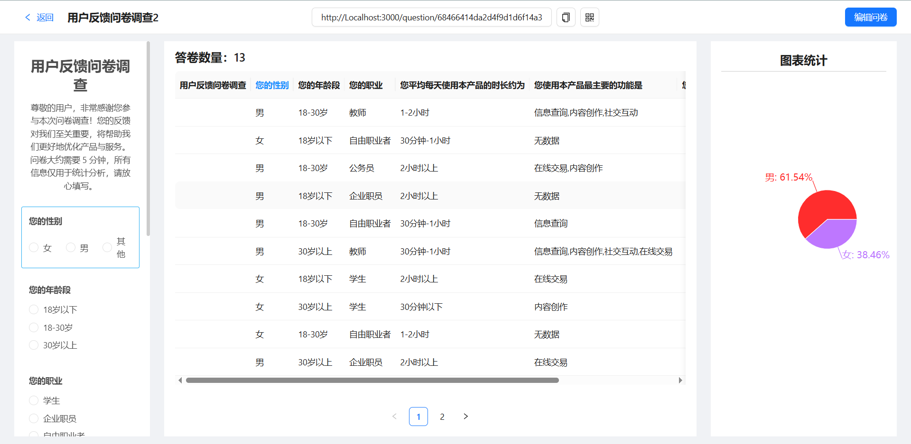
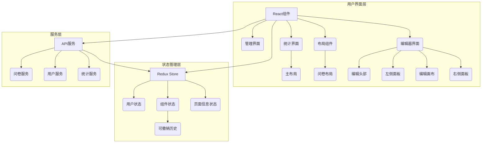
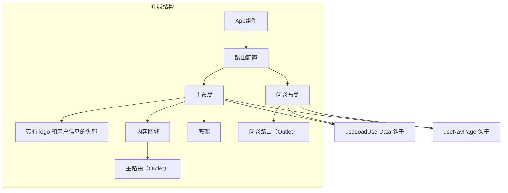
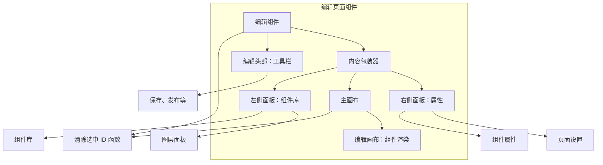
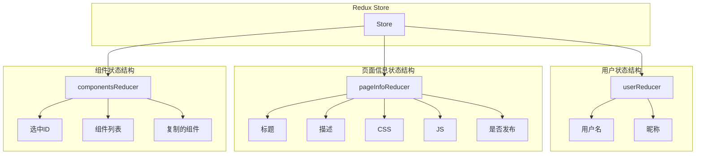

## 🎯 概述

### 项目简介

`问卷小筑`是一个基于 `React` 的问卷管理`低代码`应用，允许用户创建、编辑、管理和分析调查问卷。应用提供`直观`的用户界面，使用户能够`轻松设计`复杂的问卷并收集`反馈数据`。

**项目详细文档**：[点我查看](https://xueldx.github.io/projects/QuickSurvey-fe/Overview/overview)
### 核心功能

**五大主要功能**

- **问卷编辑器**：提供可视化的问卷编辑功能，支持组件的拖拽、属性配置等。

- **组件库**：包含多种问卷组件，如单选题、多选题、文本题等。

- **问卷管理模块**：用于管理问卷列表，支持查看、复制、删除等操作。

- **数据统计模块**：对收集到的问卷数据进行分析和可视化展示。

- **用户认证模块**：实现用户的注册、登录、权限控制等功能。
 

### 用户价值

- 为企业、教育机构和个人提供便捷的**问卷调查工具**
- **简化**数据收集过程，提高调查**效率**
- 通过直观的**数据分析**，帮助用户做出更明智的决策

## 🖼️ 项目截图


<br>

<br>

<br>

<br>

<br>

<br>

## 🎉 架构

### 系统架构概览

问卷小筑前端（PC 端）应用采用现代前端架构模式，包括`基于组件`的 UI、`集中式状态管理`和明确的关注点分离。



### 布局架构

应用为不同部分使用不同的布局：



- **主布局**：提供带有头部、内容和页脚的标准应用布局
- **问卷布局**：用于问卷相关页面的简化布局
- 两种布局都使用`useLoadUserData`钩子获取用户数据和`useNavPage`钩子进行路由鉴权控制

### 编辑器界面架构

编辑器界面分为四个主要部分：



编辑器页面结合多个面板创建完整的编辑体验：

- **编辑头部**：包含保存和发布和`编辑问卷`所需的各种工具和操作
- **左侧面板**：包含`组件库`和图层管理
- **编辑画布**：`渲染`正在编辑的实际问卷组件
- **右侧面板**：显示所选组件的`属性`编辑器或页面设置

### 状态管理架构

应用使用 `Redux` 进行状态管理，store 分为`三个`主要部分：



- **用户状态**：包含用户认证和个人资料信息
- **组件状态**:管理问卷组件，包括：
  - `selectedId`：当前选中的组件
  - `componentList`：问卷中的组件数组
  - `copiedComponent`：当前复制的组件（用于复制/粘贴操作）
- **页面信息状态**：存储问卷元数据，如标题、描述、CSS、JS 和发布状态

组件状态使用 `redux-undo` 增强，提供`撤销/重做`功能，并排除特定不应包含在历史记录中的操作。

## ⭐ 核心技术栈

### 核心框架与库

| 类别         | 技术/库          | 版本    | 用途                          |
| ------------ | ---------------- | ------- | ----------------------------- |
| **核心框架** | React            | ^18.2.0 | 用户界面构建                  |
|              | TypeScript       | ^4.9.5  | 类型检查与静态分析            |
| **状态管理** | @reduxjs/toolkit | ^1.9.2  | Redux 工具包，简化 Redux 开发 |
|              | react-redux      | ^8.0.5  | React 绑定的 Redux            |
|              | redux-undo       | ^1.0.1  | 提供撤销/重做功能             |
| **路由管理** | react-router-dom | ^6.8.1  | 应用路由管理                  |

### UI 组件与样式

| 类别          | 技术/库           | 版本    | 用途                 |
| ------------- | ----------------- | ------- | -------------------- |
| **UI 组件库** | antd              | ^5.1.7  | Ant Design UI 组件库 |
|               | @ant-design/icons | ^5.0.1  | Ant Design 图标库    |
| **样式处理**  | sass              | ^1.58.0 | CSS 预处理器         |
|               | classnames        | ^2.5.1  | 条件性 CSS 类名管理  |

### 功能库

| 类别            | 技术/库            | 版本   | 用途                          |
| --------------- | ------------------ | ------ | ----------------------------- |
| **拖拽功能**    | @dnd-kit/core      | ^6.0.8 | 拖拽核心功能                  |
|                 | @dnd-kit/sortable  | ^7.0.2 | 拖拽排序功能                  |
|                 | @dnd-kit/utilities | ^3.2.1 | 拖拽工具函数                  |
| **数据可视化**  | recharts           | ^2.4.3 | 基于 React 的图表库           |
| **HTTP 请求**   | axios              | ^1.3.2 | HTTP 客户端                   |
| **React Hooks** | ahooks             | ^3.7.4 | 阿里巴巴开源的 React Hooks 库 |

### 工具库

| 类别         | 技术/库           | 版本   | 用途             |
| ------------ | ----------------- | ------ | ---------------- |
| **实用工具** | lodash.clonedeep  | ^4.5.0 | 深拷贝对象       |
|              | copy-to-clipboard | ^3.3.3 | 复制内容到剪贴板 |
|              | qrcode.react      | ^3.1.0 | 生成二维码       |
|              | mockjs            | ^1.1.0 | 模拟数据生成     |

### 开发工具

| 类别         | 技术/库             | 版本    | 用途                          |
| ------------ | ------------------- | ------- | ----------------------------- |
| **构建工具** | webpack             | ^5.75.0 | 模块打包工具                  |
|              | @craco/craco        | ^7.0.0  | Create React App 配置覆盖工具 |
| **代码质量** | eslint              | ^8.33.0 | 代码检查工具                  |
|              | prettier            | ^2.8.3  | 代码格式化工具                |
|              | husky               | ^8.0.3  | Git hooks 工具                |
| **开发环境** | storybook           | ^6.5.16 | UI 组件开发环境               |
|              | source-map-explorer | ^2.5.3  | 分析 JavaScript 包大小        |

### 测试工具

| 类别         | 技术/库                     | 版本       | 用途                |
| ------------ | --------------------------- | ---------- | ------------------- |
| **测试框架** | jest                        | 内置于 CRA | JavaScript 测试框架 |
| **测试工具** | @testing-library/react      | ^13.4.0    | React 组件测试      |
|              | @testing-library/jest-dom   | ^5.16.5    | DOM 测试断言        |
|              | @testing-library/user-event | ^13.5.0    | 用户事件模拟        |

## 🛠️ 项目设置

### 环境要求

- Node.js 14.0+
- npm 6.0+ 或 yarn 1.22+

### 安装步骤

> 推荐先启动配套后端服务

1. 克隆仓库

   ```
   git clone https://github.com/xueldx/QuickSurvey-fe.git
   cd QuickSurvey-fe
   ```

2. 安装依赖

   ```
   npm install
   # 或
   yarn
   ```

3. 启动开发服务器

   ```
   npm start
   # 或
   yarn start
   ```

   应用将在 [http://localhost:3000](http://localhost:3000/) 运行

### 可用脚本

```js
npm start //在开发模式下运行应用。在浏览器中打开 http://localhost:3000查看。
```

```js
npm test //以交互式监视模式启动测试运行器。
```

```js
npm run build  //将应用构建到build文件夹。
```

### 项目结构

```
QuickSurvey-fe/
├── public/              # 静态资源
├── src/                 # 源代码
│   ├── components/      # 通用组件
│   ├── hooks/           # 自定义钩子
│   ├── layouts/         # 布局组件
│   ├── pages/           # 页面组件
│   ├── services/        # API服务
│   ├── store/           # Redux状态管理
│   ├── utils/           # 工具函数
│   ├── App.tsx          # 应用入口组件
│   └── index.tsx        # 应用入口文件
├── .eslintrc.js         # ESLint配置
├── .prettierrc          # Prettier配置
├── package.json         # 项目依赖和脚本
├── tsconfig.json        # TypeScript配置
└── README.md            # 项目说明
```

### 开发指南

#### `Storybook`

项目使用 Storybook 进行`组件开发和预览`。可以使用以下命令启动 Storybook：

```bash
npm run storybook
```

Storybook 将在 `http://localhost:6006` 上启动。

#### `代码规范`

项目使用 ESLint 和 Prettier 进行`代码格式化`和质量检查。确保在提交代码前运行：

```
npm run lint
```